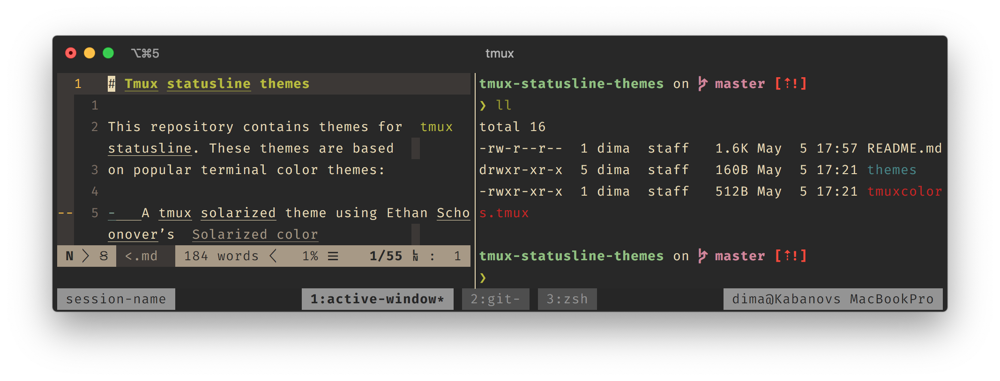

# Tmux statusline themes

This repository contains themes for `tmux` statusline. These themes are based
on popular terminal color themes:

-   [Ayu](https://github.com/ayu-theme) by Ike Ku and Konstantin Pschera
-   [Gruvbox color scheme](https://github.com/morhetz/gruvbox-contrib)
    by Pavel Pertsev
-   [Solarized](http://ethanschoonover.com/solarized) by Ethan Schoonover
-   [Two Firewatch](https://github.com/rakr/vim-two-firewatch) by
    Ramzi Akremi 

The following light and dark options are implemented:
- ayu-light
- gruvbox-dark
- gruvbox-light-hard
- solarized-light
- solarized-dark
- two-firewatch-dark

This is what Gruvbox dark theme looks like:

## Installation

### Installation with [Tmux Plugin Manager](https://github.com/tmux-plugins/tpm) (preferred method)

Add plugin to the list of TPM plugins in `.tmux.conf`:

    set -g @plugin 'dmitry-kabanov/tmux-statusline-themes'

Hit `prefix + I` to fetch the plugin and source it.

### Manual installation

Here I assume that you want to install themes into directory
`$HOME/.tmux/tmux-statusline-themes`.

1.  Go to the directory `$HOME/.tmux`. If it doesn't exist, create it.

2.  Clone this repository:
    
        git clone git@github.com:dmitry-kabanov/tmux-statusline-themes.git

3.  To apply one of the themes, invoke the following command in any pane inside
    of `tmux`:

        tmux source-file $HOME/.tmux/tmux-statusline-themes/themes/<theme>.tmuxtheme

## Usage

Choose theme by adding one of the options to `.tmux.conf`:

- `set -g @tmux-statusline-theme 'ayu-light'`,
- `set -g @tmux-statusline-theme 'gruvbox-dark'` (the default),
- `set -g @tmux-statusline-theme 'solarized-light'`,
- `set -g @tmux-statusline-theme 'solarized-dark'`,
- `set -g @tmux-statusline-theme 'two-firewatch-dark'`.

## License

This repo uses [MIT license](LICENSE).
